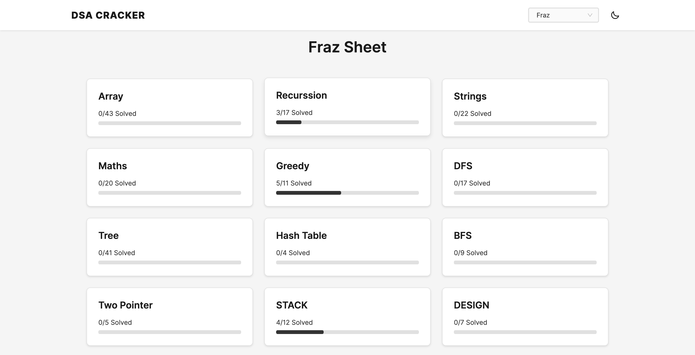

# PrepDSA

A modern web application to help you track and solve Data Structures and Algorithms (DSA) problems efficiently. Built with React and designed to provide a seamless learning experience.

## Application Preview




## Features

- 📚 **Comprehensive DSA Topics**: Covers essential DSA topics including Arrays, Strings, Linked Lists, Trees, and more
- ✅ **Progress Tracking**: Track your progress for each topic with visual indicators
- 🌓 **Dark Mode**: Toggle between light and dark themes for comfortable coding sessions
- 🔍 **Search Functionality**: Quickly find specific problems within each topic
- 🔗 **Multiple Resources**: Access problems from various platforms (LeetCode, GeeksforGeeks, Coding Ninjas)
- 📊 **Visual Progress**: See your completion status with intuitive progress bars
- 💾 **Local Storage**: Your progress is saved locally and persists between sessions

## Available Topics

The application currently covers the following DSA topics:

- **Array**: 43 Problems
- **Recursion**: 17 Problems
- **Strings**: 22 Problems
- **Maths**: 20 Problems
- **Greedy**: 11 Problems
- **DFS**: 17 Problems
- **Tree**: 41 Problems
- **Hash Table**: 4 Problems
- **BFS**: 9 Problems
- **Two Pointer**: 5 Problems
- **Stack**: 12 Problems
- **Design**: 7 Problems

## Tech Stack

- React.js
- React Router for navigation
- CSS with custom variables for theming
- Local Storage for data persistence

## Getting Started

### Prerequisites

- Node.js (v14 or higher)
- npm or yarn

### Installation

1. Clone the repository:
```bash
git clone https://github.com/yourusername/dsa-cracker.git
cd dsa-cracker
```

2. Install dependencies:
```bash
npm install
# or
yarn install
```

3. Start the development server:
```bash
npm start
# or
yarn start
```

4. Open [http://localhost:3000](http://localhost:3000) to view it in your browser.

## Project Structure

```
src/
├── components/
│   ├── navbar/          # Navigation bar component
│   ├── topic/           # Topic listing component
│   ├── topiccard/       # Individual topic card component
│   └── questions/       # Questions listing component
├── App.jsx              # Main application component
├── App.css              # Global styles
└── 450DSAFinal.js       # DSA questions data
```

## Usage

1. **Browse Topics**: View all available DSA topics on the home page
2. **Track Progress**: Click on questions to mark them as solved
3. **Search Questions**: Use the search bar to find specific problems
4. **Access Resources**: Click on platform links (LeetCode, GeeksforGeeks, CN) to solve problems
5. **Toggle Theme**: Switch between light and dark modes using the theme toggle

## Contributing

Contributions are welcome! Please feel free to submit a Pull Request.

1. Fork the repository
2. Create your feature branch (`git checkout -b feature/AmazingFeature`)
3. Commit your changes (`git commit -m 'Add some AmazingFeature'`)
4. Push to the branch (`git push origin feature/AmazingFeature`)
5. Open a Pull Request

## License

This project is licensed under the MIT License - see the [LICENSE](LICENSE) file for details.

## Acknowledgments

- DSA questions curated from various coding platforms
- Icons from [Unicons](https://iconscout.com/unicons)
- Inspired by the need for a better DSA practice tracking tool
